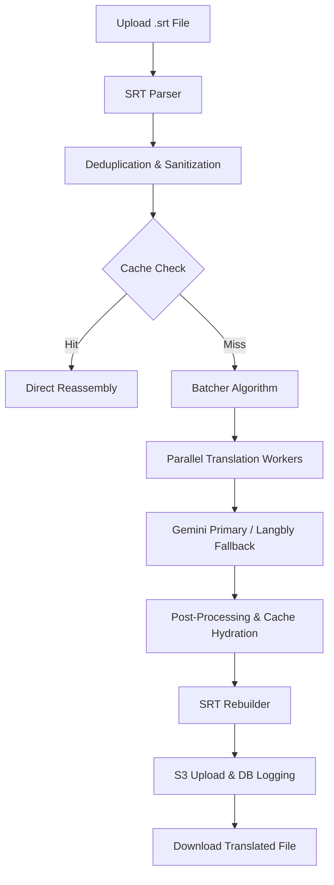

# Sisub Subtitle Converter
> A high-performance, AI-powered subtitle translation engine for seamless SRT localization.

## 🌟 Project Overview
**Sisub** is a robust web application designed to automate the translation of subtitle files (SRT) while maintaining perfect synchronization and formatting. Built for speed and reliability, Sisub leverages state-of-the-art AI models like Gemini and Langbly to deliver contextually accurate translations specifically tuned for Cinematic/Sinhala linguistic nuances.

The system is optimized for low-resource VPS environments (2GB RAM), ensuring cost-effective yet powerful subtitle processing without compromising on quality or stability.

---

## ✨ Key Features
- **Smart SRT Parsing**: Automatically extracts text blocks while preserving indices, timestamps, and style tags (`<i>`, `<b>`, etc.).
- **AI-Powered Translation**: Context-aware translation using **Google Gemini** and **Langbly** API fallbacks.
- **Advanced Batching**: Aggregates subtitle lines into optimized batches to reduce API latency and costs.
- **Parallel Processing**: Multi-worker architecture (default: 3 concurrent workers) for high-speed throughput.
- **Global LRU Caching**: Intelligent sentence-level caching (up to 5,000 phrases) to minimize redundant API calls.
- **NDJSON Streaming**: Real-time progress tracking via Server-Sent Events/NDJSON for a transparent user experience.
- **Structure Preservation**: Guarantees that the output SRT file is structurally identical to the source, ensuring no sync issues in media players.
- **Cloud Integration**: Automatic storage of original and translated files in AWS S3 for record-keeping.

---

## 🏗️ System Architecture
The subtitle processing pipeline follows a sophisticated, multi-stage workflow designed for maximum efficiency:



1. **Upload**: User submits an SRT file via the Next.js interface.
2. **Parse**: The file is broken into logical subtitle blocks (Index, Time, Text).
3. **Batch**: Subtitles are grouped by character weight and count (max 50 items/2000 chars per batch).
4. **Translate**: Batches are dispatched to parallel workers with exponential backoff retry logic.
5. **Merge**: Translated chunks are mapped back to their original indices, replacing source text.
6. **Generate**: A valid SRT file is reconstructed and streamed back to the client.

---

## 💻 Technology Stack
- **Framework**: [Next.js 14](https://nextjs.org/) (App Router)
- **Language**: TypeScript
- **Database**: PostgreSQL with [Prisma ORM](https://www.prisma.io/)
- **AI Engines**: 
  - Google Generative AI (Gemini 2.5 Flash)
  - Langbly Translation API
- **Storage**: AWS S3 (for backup/history)
- **Infrastructure**: DigitalOcean VPS
- **Server**: Nginx (configured for NDJSON streaming)

---

## 🚀 Installation Guide

### 1. Clone the Repository
```bash
git clone https://github.com/yourusername/sisub-subtitle-converter.git
cd sisub-subtitle-converter
```

### 2. Install Dependencies
```bash
npm install
```

### 3. Database Setup
Initialize your Prisma client and push the schema to your database:
```bash
npx prisma generate
npx prisma db push
```

### 4. Run Development Server
```bash
npm run dev
```

---

## ⚙️ Environment Configuration
Create a `.env` file in the root directory and populate it with the following:

| Variable | Description |
| :--- | :--- |
| `DATABASE_URL` | PostgreSQL connection string |
| `NEXTAUTH_SECRET` | Secret key for session encryption |
| `GEMINI_API_KEY` | API key from Google AI Studio |
| `LANGLY_API_KEY` | API key for Langbly translation fallback |
| `AWS_ACCESS_KEY_ID` | AWS Credentials for S3 |
| `AWS_SECRET_ACCESS_KEY` | AWS Credentials for S3 |
| `AWS_S3_BUCKET` | The name of your S3 bucket |

---

## 📂 Project Structure
```text
├── src/
│   ├── app/            # Next.js App Router (API & UI)
│   ├── components/     # UI Components (Radix UI, Tailwind)
│   ├── lib/            # Core Logic (AI, SRT Parsing, Queue)
│   │   ├── srt.ts      # SRT parsing/building logic
│   │   ├── gemini.ts   # AI interaction layer
│   │   └── translator-queue.ts # Batching & fallback management
├── prisma/             # Schema definitions
├── public/             # Static assets
└── .env.example        # Environment template
```

---

## 🛠️ Usage Instructions
1. **Upload**: Drag and drop your `.srt` file into the upload zone.
2. **Translate**: Click "Translate". The system will begin processing in real-time.
3. **Track**: Monitor the progress bar as the AI processes batches.
4. **Download**: Once 100% complete, your translated file will be available for immediate download.

---

## ⚡ Performance Optimization
- **Memory Management**: Optimized for 2GB VPS via V8 heap yielding and LRU (Least Recently Used) caching.
- **Batching Algorithm**: Reduces API overhead by grouping small segments into single prompts.
- **Retry Mechanism**: Implements exponential backoff (2s -> 4s -> 8s) to handle API rate limits (429) or transient errors (503).
- **NDJSON Streaming**: Uses whitespace padding to bypass Nginx/Vercel proxy buffers, ensuring a stable real-time connection.

---

## 🌐 Deployment
The project is designed to run on a **DigitalOcean VPS** behind **Nginx**. 
> [!IMPORTANT]
> Ensure your Nginx configuration includes `proxy_buffering off;` and `X-Accel-Buffering no;` to support progress streaming.

---

## 🔮 Future Improvements
- [ ] Support for `.vtt` and `.ass` formats.
- [ ] Fine-tuned model training for better informal/slang translation.
- [ ] Multi-file/Batch upload support.
- [ ] Integration with more providers (DeepL, OpenAI).

---

## 🤝 Contributing
Contributions are welcome! Please feel free to submit a Pull Request.

---

## 📄 License
This project is licensed under the [MIT License](LICENSE).
